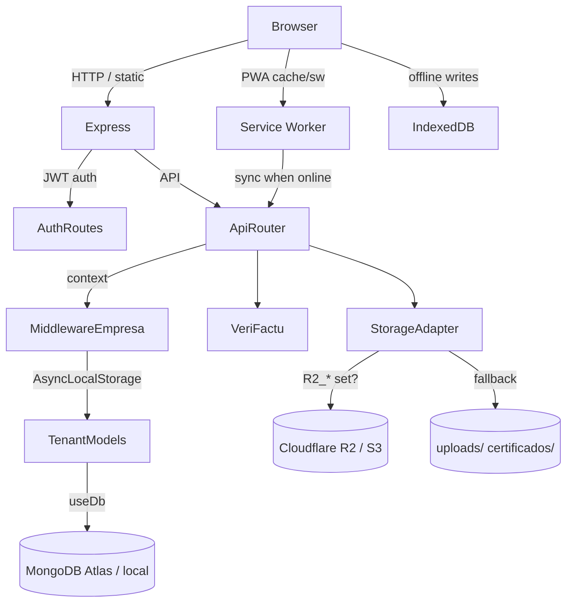

# AGENTS.md

This file provides guidance to Verdent when working with code in this repository.

## Table of Contents

1. Commonly Used Commands
2. High-Level Architecture & Structure
3. Key Rules & Constraints
4. Development Hints

## Commands

Backend (`nexospro/server/`):

- `npm install` — install dependencies (also installs Playwright Chromium via postinstall).
- `npm run dev` — start API with `--watch` on `PORT` (default `4700`).
- `npm start` — start API in production mode.
- `node scripts/limpiar-pruebas.mjs` — clean temporary stress-test data/users.
- `server\scripts\backup-mongo.cmd` — run `mongodump` to `server\backups\...`.

Frontend (`nexospro/client/`):

- `npm install` — install dependencies.
- `npm run dev` — Vite dev server (default `5173`).
- `npm run build` — build static assets to `dist/`.
- `npm run lint` — run oxlint.
- `npm run preview` — preview the production build.

Stress testing:

- Set `STRESS_TEST=true` before starting the server to relax rate limiting (`100000 req/min`).
- Example: `set STRESS_TEST=true && node src/index.js` (Windows) or `STRESS_TEST=true node src/index.js`.
- Run `node scripts/stress-test.js <email> <password>` against a running server.

Production (single port):

- Build the client, then run the server: it serves `client/dist` statically on the same port as the API.

## Architecture

FILANEX / NEXOSPRO is a multi-tenant SaaS for invoicing, workshop management, and telephony, with an optional local/on-premise deployment.

- **Backend**: Node.js + Express + Mongoose. Entry point: `nexospro/server/src/index.js`.
- **Frontend**: React + Vite + Tailwind CSS. Entry point: `nexospro/client/src/main.jsx`.
- **Database**: MongoDB. One platform database (`filanex_plataforma`) holds accounts and tenants; each company gets its own business database (`filanex_<slug>`).
- **Files**: abstracted through `server/src/services/storage.js`. Local filesystem by default; switches to S3/R2-compatible storage when `R2_ENDPOINT`/`R2_ACCESS_KEY`/`R2_SECRET_KEY`/`R2_BUCKET` are set.
- **VeriFactu**: invoice registrations are created synchronously and sent to AEAT asynchronously; a retry job (`server/src/services/verifactu-reintento.js`) handles failures in the background.
- **PWA**: service worker at `client/public/sw.js`, manifest at `client/public/manifest.webmanifest`, offline queue in `client/src/lib/colaOffline.js` and `client/src/hooks/useSync.js`.

### Request/response lifecycle

1. Express receives request.
2. Public routes (`/api/auth`, `/api/health`, `/api/telefonia` webhook) bypass auth.
3. `/api/admin/tenants` requires auth but no company context.
4. All other `/api/*` routes require JWT (`Authorization: Bearer <token>`).
5. `middlewareEmpresa` reads the company (`db` + `t`/`slug`) from the JWT and stores it in `AsyncLocalStorage` (`server/src/models/tenant.js`).
6. `idempotencia` middleware deduplicates `POST/PUT/DELETE` using `Idempotencia-Key` header.
7. Route handlers use tenant models (`modeloTenant` proxies) that automatically resolve to the correct company database.

### Subsystem relationships

## Key Rules & Constraints

- **Multi-tenancy via context, not params**: never hard-code a database name in route handlers. Use `modeloTenant(...)` and the `AsyncLocalStorage` context set by `middlewareEmpresa`.
- **File storage abstraction**: always use `server/src/services/storage.js` (`guardarArchivo`, `leerArchivo`, `borrarArchivo`) instead of direct `fs` writes for uploaded files or certificates.
- **Atomic numbering**: use `tomarNumeroFacturaVentaAtomico()` and `tomarNumeroOrdenTrabajoAtomico()` from `server/src/services/numeracion.js`. Do not use the old `tomarNumero()` helper for these flows.
- **VeriFactu must not block HTTP responses**: the `emitir` endpoint creates the registration and invoice, then sends to AEAT in the background (`enviarRegistroVerifactu(...).catch(() => {})`). Failures are retried by `verifactu-reintento.js`.
- **Rate limiting**: `STRESS_TEST=true` is required to run load tests; otherwise the general API limiter (`300 req/min` by default) blocks aggressive scripts.
- **Do not commit `.env` or certificates**: `server/.env` and `*.pfx` are gitignored. The AEAT certificate path is configured locally and never uploaded.
- **CORS is restricted**: allowed origins are `FRONTEND_URL`, `localhost:4700`, `localhost:5173`, and their `127.0.0.1` equivalents.
- **Production runs on one port**: `npm run build` in `client/` produces `client/dist`; the server serves it and the API together from `PORT`.
- **Context can be lost across async boundaries** (especially after multer/file uploads). Capture `req.contextoEmpresa` and restore with `conContexto(...)` when calling tenant-model code after an external async call.

## Development Hints

- **Adding a new API endpoint**: add the route file under `server/src/routes/`, import it in `server/src/routes/index.js`, and mount it after `requiereAuth`/`middlewareEmpresa` unless it must be public. Use tenant models via `modeloTenant` if you add a new collection.
- **Adding a new frontend page**: create the component in `client/src/pages/` (or an existing submodule folder), add the route in `client/src/App.jsx`, and add the navigation link in `client/src/components/Layout.jsx`.
- **Modifying CI/CD or deploy config**: update `render.yaml` (backend), `netlify.toml` / `client/public/_redirects` (frontend), and environment variables in `.env.example`.
- **Running database scripts**: most scripts use `process.env.MONGODB_URI_BASE || "mongodb://localhost:27017"` and accept the database name as a CLI argument. Run them from `nexospro/server/`.
- **Resetting atomic counters**: `node scripts/reset-contadores.mjs [dbName]` deletes the `contadors` collection; the next numbered document will re-initialize from `max + 1`.
- **Testing PWA offline**: build the client, start the server in production mode, register the service worker, then enable airplane mode and retry queued writes.
- **Avoid `fs` directly in routes that handle uploads**: use the storage adapter so the same code works on local disk and S3/R2.
